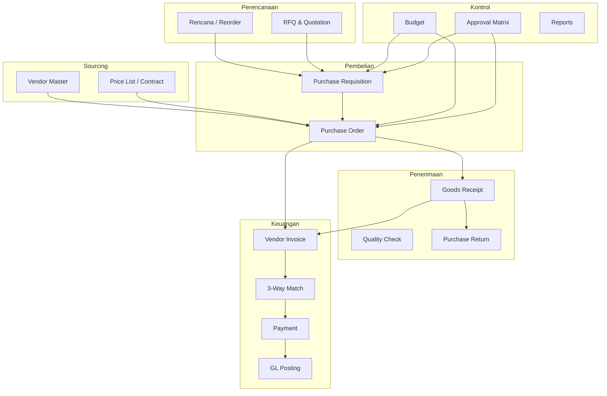

# Modul Procurement — Roadmap & Patokan KEA One

Dokumen referensi untuk mengembangkan modul pembelian (`purchase`) menjadi **modul procurement lengkap**.

Gunakan dokumen ini saat merencanakan fitur baru, migration DB, menu RBAC, dan urutan sprint.

---

## Ringkasan

| Aspek | Kondisi saat ini (Aug 2026) |
|-------|----------------------------|
| Nama modul | `purchase` (ModuleCatalog, RBAC menu) — UI label **Pengadaan** |
| Flow | `direct`, `po_gr`, `strict_pr_po_gr` |
| Dokumen | PR, PO, GR, **PRN (retur)** |
| Approval | Multi-level sequential (PR, PO, retur) |
| Settings | `config/procurement.php` — flow, approval, fitur, matching |
| Partisi MySQL | GR, PRN + child tables (lihat `mysql-partitions.md`) |
| Belum ada | RFQ, AP/invoice, 3-way match, budget, vendor portal |

**Target jangka panjang:** rename / alias `modules.procurement` dengan submenu lengkap, tanpa breaking change untuk tenant yang sudah pakai `purchase`.

---

## Yang sudah ada (baseline)

### Backend

| Area | Path |
|------|------|
| Logic utama | `app/Services/PurchaseService.php` |
| PR | `app/Models/PurchaseRequisition.php`, `PurchaseRequisitionItem.php`, `PurchaseRequisitionApproval.php` |
| PO | `app/Models/PurchaseOrder.php`, `PurchaseOrderItem.php`, `PurchaseOrderApproval.php` |
| GR | `app/Models/GoodsReceipt.php`, `GoodsReceiptItem.php` |
| Supplier API | `app/Http/Controllers/Api/V1/SupplierController.php` |
| PR / PO / GR API | `PurchaseRequisitionController`, `PurchaseOrderController`, `GoodsReceiptController` |
| Approval inbox | `ApprovalController` |
| Public share | `PublicPurchaseRequisitionController`, `PublicPurchaseOrderController` |
| RBAC menu | `app/Support/MenuCatalog.php` |
| Module toggle | `app/Support/ModuleCatalog.php` (`purchase`, default off) |

### Frontend

| Area | Path |
|------|------|
| Desktop app | `frontend/src/desktop/PurchaseApp.tsx` |
| Approval app | `frontend/src/desktop/ApprovalsApp.tsx` |
| Dokumen PR/PO/GR | `frontend/src/pages/purchase/PurchaseDocs.tsx` |
| PR approved → PO | `frontend/src/pages/purchase/ApprovedPrPoBoard.tsx` |
| Settings | `frontend/src/pages/purchase/PurchaseSettings.tsx` |
| Approver autocomplete | `frontend/src/components/AutocompleteSelect.tsx`, `pages/purchase/approverOptions.ts` |
| Supplier (Master) | `frontend/src/desktop/MasterApp.tsx` |

### Database (tabel inti)

| Tabel | Fungsi |
|-------|--------|
| `purchase_requisitions` | Header PR |
| `purchase_requisition_items` | Baris PR |
| `purchase_requisition_approvals` | Approver PR per level |
| `purchase_orders` | Header PO |
| `purchase_order_items` | Baris PO (`qty_received`, discount) |
| `purchase_order_approvals` | Approver PO per level |
| `goods_receipts` | Header GR |
| `goods_receipt_items` | Baris GR |
| `contacts` | Supplier (`type = supplier/both`) |
| `companies.settings` | Flow & flag approval (JSON) |

### Status dokumen

**PR:** `draft` → `submitted` → `approved` / `rejected` / `cancelled`

**PO:** `draft` → `submitted` → `approved` → `ordered` → `partial` → `received` / `rejected` / `cancelled`

**GR:** `draft` → `confirmed` / `cancelled`

### Settings perusahaan (`companies.settings`)

| Key | Default | Efek |
|-----|---------|------|
| `purchase_flow` | `direct` | `direct` / `po_gr` / `strict_pr_po_gr` |
| `purchase_update_cost` | `true` | Update `cost_price` produk saat GR confirm |
| `pr_need_approval` | `false` | PR wajib approver saat submit |
| `po_need_approval` | `false` | PO wajib approver saat submit |

### Flow behaviour

| Flow | PR | PO | GR |
|------|----|----|-----|
| `direct` | — | — | Wajib (supplier mandatory) |
| `po_gr` | — | Wajib | Dari PO ordered/partial |
| `strict_pr_po_gr` | Wajib | Dari PR approved | Dari PO |

### Fitur operasional yang sudah jalan

- Multi-unit di baris (product_units)
- Partial receiving (`qty_received`)
- Multi-level approval sequential (PR & PO)
- Approver bebas dipilih (nama + jabatan di UI, tanpa validasi rank)
- PO dari PR approved (multi-supplier per line → split PO)
- Approver PR boleh kurangi qty / hapus line (tidak boleh naikkan)
- PDF + WhatsApp share + public link (PR & PO)
- Tax & payment term snapshot dari supplier ke PO
- Activity log + notifikasi approval

---

## Level kematangan procurement

| Level | Cakupan | KEA One |
|-------|---------|---------|
| **Basic** | PO + GR / direct receipt | ✅ |
| **Standard** | PR → PO → GR + approval | ✅ |
| **Professional** | + Vendor invoice, 3-way match, return | ❌ |
| **Enterprise** | + RFQ, budget, vendor portal, approval matrix | ❌ |
| **Strategic** | + Contract, demand planning, analytics | ❌ |

---

## Roadmap lengkap (by fase)

### Fase 1 — Operasional

Melengkapi operasional harian gudang & purchasing.

| # | Fitur | Status | Deskripsi |
|---|--------|--------|-----------|
| 1.1 | **Purchase Return (PRN)** | ✅ | Retur barang ke supplier, kurangi stok |
| 1.2 | **GR Reversal / Void** | ✅ | Batalkan GR confirmed — rollback stok & qty PO |
| 1.3 | **Debit / Credit Note** | ✅ | Koreksi harga atau qty setelah GR |
| 1.4 | **Partial PO close** | ✅ | Tutup PO ordered/partial — stop penerimaan |
| 1.5 | **Delivery schedule** | ✅ | Jadwal kirim per PO / per line |
| 1.6 | **Attachment** | ✅ | Lampiran quotation, foto barang |
| 1.7 | **Cost center / dept** | ✅ | PR/PO per divisi atau outlet |
| 1.8 | **Procurement dashboard** | ✅ | Antrian PR/PO/GR/retur, overdue, spend MTD |

**Deliverables tipikal per fitur:** migration → model → service → controller + route → RBAC menu → frontend page → i18n → seeder demo (opsional).

---

### Fase 2 — Keuangan (Procurement ↔ Finance)

Dari “beli barang” menjadi “beli + catat hutang + bayar”.

| # | Fitur | Status | Deskripsi | Entitas |
|---|--------|--------|-----------|---------|
| 2.1 | **Vendor Invoice (AP)** | ✅ | Tagihan supplier | `vendor_invoices`, `vendor_invoice_items` |
| 2.2 | **3-way match** | ✅ | PO ↔ GR ↔ Invoice (qty & harga) | `match_exceptions`, tolerance rules |
| 2.3 | **2-way match** | ✅ | PO ↔ Invoice (jasa / non-stock) | Setting per kategori produk |
| 2.4 | **Payment request / batch** | ✅ | Ajukan & batch bayar supplier | Integrasi cash/bank |
| 2.5 | **Prepayment / DP** | ✅ | Uang muka supplier | `vendor_prepayments` |
| 2.6 | **Withholding tax (PPh)** | ✅ | PPh 23 / 22 / 4(2) | Tax rules per supplier |
| 2.7 | **GL posting** | ✅ | Jurnal otomatis GR, invoice, payment | COA mapping |
| 2.8 | **Budget check** | ✅ | Cek budget saat PR/PO submit | `budgets`, `budget_lines`, `commitments` |

**Catatan:** Modul `invoice` terpisah mungkin sudah ada — wire ke PO/GR, jangan duplikasi AP.

---

### Fase 3 — Sourcing (sebelum PO)

| # | Fitur | Status | Deskripsi | Entitas |
|---|--------|--------|-----------|---------|
| 3.1 | **RFQ / Quotation** | ✅ | Minta penawaran ke beberapa supplier | `rfqs`, `rfq_items`, `vendor_quotes` |
| 3.2 | **Quote comparison** | ✅ | Banding side-by-side, pilih winner | UI matrix |
| 3.3 | **PR from RFQ** | ✅ | PR/PO dari quote terpilih | Link `rfq_id` |
| 3.4 | **Vendor price list** | ✅ | Harga kontrak supplier × produk | `supplier_product_prices` |
| 3.5 | **Preferred vendor** | ✅ | Supplier default per kategori/produk | Config product/category |
| 3.6 | **Procurement item** | ✅ | Item non-inventory (jasa, ATK) — boleh dipilih di PR/PO | `products.is_procurement_item` |
| 3.7 | **Fixed asset receipt** | ✅ | PO/GR untuk aset tetap → kartu aset, bukan stok gudang | `products.is_fixed_asset_item` + `assets` |

#### Catatan arsitektur — jenis item procurement (3.6 & 3.7)

Tiga jenis baris pembelian punya **posting penerimaan berbeda**. Jangan digabung ke satu flag saja.

| Jenis | Contoh | Flag produk (saat ini / target) | `track_stock` | Saat GR confirm |
|-------|--------|----------------------------------|---------------|-----------------|
| **Inventory** | Bahan baku, bahan POS | kategori `is_raw_material` | ✅ true | `InventoryService` → gudang |
| **Procurement / expense** | ATK, jasa cleaning | `is_procurement_item` ✅ | ❌ false | Biaya langsung / expense (GL) — belum full |
| **Fixed asset** | Laptop, meja, mesin | `is_fixed_asset_item` ⬜ | ❌ false | Buat kartu aset per unit — **modul asset belum ada** |

**Dimensi yang disarankan (2 layer):**

1. **Eligibility** — `is_procurement_item`: produk boleh muncul di picker PR/PO/RFQ meski bukan bahan baku.
2. **Receipt type** — apa yang terjadi saat GR confirm:
   - `inventory` → stok gudang (`track_stock`)
   - `expense` → biaya / consumable non-stok
   - `fixed_asset` → register aset (bukan qty di warehouse)

Alternatif implementasi: enum `receipt_type` di `products` menggantikan kombinasi flag; atau flag terpisah `is_fixed_asset_item` yang mutually exclusive dengan perilaku stok.

**Implementasi saat ini (3.6):**

- Kolom `products.is_procurement_item` (migration `2026_08_30_219000`)
- UI: checkbox di **Master Produk** → *Item procurement / non-inventory*
- API filter `for_purchase`: `is_procurement_item` OR kategori bahan baku
- Saat flag ON → `track_stock` dipaksa `false`; GR **tidak** menambah stok gudang (`PurchaseService` cek `track_stock`)

**Target modul asset (3.7 — diimplementasi):**

```
PO (produk is_fixed_asset) → GR confirm → buat N record di assets (per qty/serial)
                                        → GL: Dr Aset Tetap / Cr Hutang
                                        (bukan Dr Persediaan)
```

| Tabel (target) | Fungsi |
|----------------|--------|
| `products` | Template/katalog (mis. Laptop Dell XPS 15) |
| `assets` | Unit fisik: nomor aset, serial, lokasi, custodian, nilai perolehan |
| `asset_movements` | Transfer, mutasi, disposal |
| `asset_depreciation` | Penyusutan periodik |

Hook utama: `PurchaseService` saat GR confirm — cabang `fixed_asset` selain cabang `track_stock` yang sudah ada.

**Timing:** Flag asset (`is_fixed_asset_item` / `receipt_type`) ditambah **bersamaan** modul asset; jangan premature sebelum tabel `assets` dan GL aset tetap siap.

---

### Fase 4 — Vendor management

| # | Fitur | Deskripsi |
|---|--------|-----------|
| 4.1 | Vendor onboarding | Registrasi + dokumen legal (SIUP, NPWP, PKP) ✅ |
| 4.2 | Vendor evaluation | Score: on-time, quality, price ✅ |
| 4.3 | Vendor category / tier | Strategic, preferred, one-time ✅ |
| 4.4 | Compliance expiry | Alert dokumen expired ✅ |
| 4.5 | Vendor portal | Supplier lihat PO, konfirmasi, upload invoice ✅ |
| 4.5a | Portal: lihat & konfirmasi PO | ✅ |
| 4.5b | Portal: upload invoice | ✅ |
| 4.6 | Blacklist / suspend | Block dari PO baru ✅ |

**Implementasi saat ini (4.x):**

- Kolom `contacts`: `vendor_tier`, `onboarding_status`, `vendor_status`, `portal_token`, `vendor_block_reason`, `vendor_approved_at` (migration `2026_08_30_221000`)
- Tabel `supplier_documents` — SIUP, NPWP, PKP, other + `expires_at` (migration `2026_08_30_221100`)
- `VendorManagementService` — tier, onboarding, suspend/blacklist, compliance alerts, portal token
- `VendorEvaluationService` — on-time % & quality score dari PO/GR
- `SupplierController` — dokumen CRUD, compliance alerts, vendor actions
- `PublicVendorPortalController` — portal public: list PO, konfirmasi, upload invoice (→ vendor invoice submitted + lampiran PDF)
- `PurchaseService::assertSupplier()` — block suspended/blacklisted/pending onboarding
- UI: panel vendor di detail pemasok, tier di form, widget compliance di dasbor pengadaan, halaman `/vendor-portal/:token`

---

### Fase 5 — Kontrak & perencanaan ✅

| # | Fitur | Deskripsi |
|---|--------|-----------|
| 5.1 ✅ | Blanket PO / Contract | Kontrak tahunan, release PO per periode |
| 5.2 ✅ | Auto-reorder | PR draft dari reorder point |
| 5.3 ✅ | Demand planning | Forecast → suggested PR |
| 5.4 ✅ | Annual procurement plan | Rencana beli per dept/tahun |
| 5.5 ✅ | Landed cost | Freight, customs, alokasi ke item |

---

### Fase 6 — Approval & governance ✅

| # | Fitur | Status | Deskripsi |
|---|--------|--------|-----------|
| 6.1 ✅ | Approval matrix | ✅ | By amount threshold + dept (bukan manual pick) |
| 6.2 ✅ | Parallel approval | ✅ | Beberapa approver satu level |
| 6.3 ✅ | Delegation / substitute | ✅ | Pengganti saat cuti |
| 6.4 ✅ | Escalation / SLA | ✅ | Auto-escalate pending > X hari |
| 6.5 ✅ | Segregation of duties | ✅ | Creator ≠ approver ≠ receiver |
| 6.6 ✅ | Field-level audit | ✅ | History perubahan qty/harga |

**Catatan:** Approval manual pick (saat ini) tetap valid untuk SME; matrix = tier enterprise.

---

### Fase 7 — Analytics & reporting ✅

| Report | Isi | Status |
|--------|-----|--------|
| Spend by supplier / category / dept | Trend belanja + tren bulanan | ✅ |
| PO cycle time | PR → PO → GR → Invoice | ✅ |
| Vendor performance | On-time %, quality, price variance | ✅ |
| Budget vs actual | Alokasi / komitmen / realisasi GR | ✅ |
| Open PO aging | Bucket 0-30 / 31-60 / 61+ hari | ✅ |
| Price variance | Match exception + PO vs GR unit cost | ✅ |
| ABC spend | Top supplier / produk (A/B/C) | ✅ |

**Implementasi:** `ProcurementReportService`, `GET /procurement/reports?kind=&from=&to=&group_by=`, menu `procurementreports`, UI `ProcurementReports.tsx`.

---

## Arsitektur target (end-state)



---

## Prioritas implementasi (rekomendasi)

| Prioritas | Fase | Fitur | Alasan |
|-----------|------|-------|--------|
| **P0** | 1 | Return, GR reversal, dashboard | Pain point operasional langsung |
| **P1** | 2 | Vendor invoice, 3-way match, payment | Pembeda ERP vs POS sederhana |
| **P2** | 1 + 3 | Cost center, RFQ, price list | Value mid-market |
| **P3** | 4 + 6 | Vendor mgmt, approval matrix | Enterprise tier |
| **P4** | 5 + 7 | Planning, analytics | Differentiator jangka panjang |

**Sprint pertama yang disarankan:** Fase 1.1–1.4 + Fase 2.1–2.2 (operasional + AP dasar).

---

## Struktur modul & menu (target)

### Rename (opsional, backward compatible)

- `modules.purchase` → alias `modules.procurement`
- `PurchaseApp` → `ProcurementApp` (frontend)
- Folder `pages/purchase/` bisa tetap atau `pages/procurement/`

### Menu desktop target

| Tab / menu | RBAC key (contoh) | Fase |
|------------|-------------------|------|
| Dashboard | `procurementdashboard` | 1.8 |
| Purchase Requisition | `purchaserequisitions` | ✅ |
| RFQ | `rfqs` | 3 |
| Purchase Order | `purchaseorders` | ✅ |
| Goods Receipt | `goodsreceipts` | ✅ |
| Purchase Return | `purchasereturns` | 1 |
| Debit / Credit Note | `vendoradjustmentnotes` | 1.3 |
| Delivery schedule | `deliveryschedules` | 1.5 |
| Vendor Invoice | `vendorinvoices` | 2.1 ✅ |
| Match exceptions | `matchexceptions` | 2.2 ✅ |
| Vendors | `suppliers` | ✅ (+ fase 4) |
| Contracts | `procurementcontracts` | 5 |
| Reports | `procurementreports` | 7 |
| Settings | `purchasesettings` | ✅ |

---

## Checklist menambah fitur procurement baru

Ikuti pola yang sudah dipakai PR/PO/GR:

### 1. Database

- [ ] Migration tabel header + items (+ approvals jika perlu)
- [ ] `company_id`, `client_uuid` (idempotency), `number` (doc numbering)
- [ ] Index reporting: `(company_id, created_at, …)`
- [ ] Partisi jika tabel append-only high-volume → lihat `docs/mysql-partitions.md`
- [ ] FK: hindari FK ke tabel terpartisi jika akan dipartisi nanti

### 2. Backend

- [ ] Model + relasi Eloquent
- [ ] Logic di service (prefer extend `PurchaseService` atau `ProcurementService` terpisah jika besar)
- [ ] Controller API v1 + validation
- [ ] Route di `routes/api.php`
- [ ] RBAC: tambah menu di `MenuCatalog.php` + migration permission seed
- [ ] Activity log mapping di `ActivityLogger.php`
- [ ] Notifikasi jika ada workflow approval
- [ ] Serialize response konsisten (`serializeX()` pattern)

### 3. Frontend

- [ ] Page atau extend `PurchaseDocs` pattern
- [ ] Types di `frontend/src/types.ts`
- [ ] i18n `id.ts` + `en.ts` (minimal)
- [ ] Nav di `PurchaseApp.tsx` / `erpNavSearch.ts`
- [ ] Permission gate `useAccess()`

### 4. Settings

- [ ] Tambah key di `Company::defaultSettings()` jika perlu flag per tenant
- [ ] UI di `PurchaseSettings.tsx` atau settings procurement terpisah

### 5. Deploy & demo

- [ ] Seeder demo (opsional)
- [ ] Update `.env.example` jika ada config baru
- [ ] Dokumentasi singkat di file ini (centang fase selesai)

---

## Gap vs enterprise (referensi cepat)

| Capability | Status |
|------------|--------|
| RFQ / RFP | ❌ |
| Vendor evaluation | ❌ |
| Blanket PO / contract | ❌ |
| Budget / commitment | ❌ |
| 3-way match | ❌ (hanya 2-way PO↔GR qty) |
| Vendor invoice / AP | ❌ |
| Purchase return | ❌ |
| GR reversal | ❌ |
| Landed cost | ❌ |
| Multi-currency | ❌ |
| Vendor portal (interactive) | ❌ (hanya public read-only link) |
| Approval by amount matrix | ❌ |
| Delegation approver | ❌ |
| Procurement analytics | ❌ |
| GL integration | ❌ |

---

## Konvensi kode (lanjutan modul existing)

| Topik | Konvensi |
|-------|----------|
| Doc numbering | `PR-`, `PO-`, `GR-` via `PurchaseService::nextNumber()` |
| Idempotent create | `client_uuid` unique per company |
| Approval chain | Array `{ user_id }` urutan = level 1, 2, 3… |
| Stock impact | Hanya lewat `InventoryService` saat GR confirm jika `track_stock`; procurement item & asset skip stok gudang |
| Cost update | `purchase_update_cost` setting |
| Share dokumen | `share_token` + public controller + SPA public page |
| Partition tables | `stock_movements`, log — lihat `config/partitions.php` |

---

## Referensi file kunci

| Area | Path |
|------|------|
| Purchase service | `backend/app/Services/PurchaseService.php` |
| Partisi DB | `backend/docs/mysql-partitions.md` |
| Menu RBAC | `backend/app/Support/MenuCatalog.php` |
| Module toggle | `backend/app/Support/ModuleCatalog.php` |
| API routes | `backend/routes/api.php` |
| Purchase UI | `frontend/src/pages/purchase/` |
| Approver UX | `frontend/src/components/AutocompleteSelect.tsx` |

---

## Log perubahan dokumen

| Tanggal | Catatan |
|---------|---------|
| 2026-08-30 | Dokumen awal — baseline PR/PO/GR + roadmap fase 1–7 |
| 2026-08-30 | Fase 7 analytics & reporting — spend, cycle time, vendor perf, budget, aging, variance, ABC |

---

*Saat menyelesaikan fase atau fitur, update tabel “Yang sudah ada” dan “Log perubahan” di dokumen ini.*
